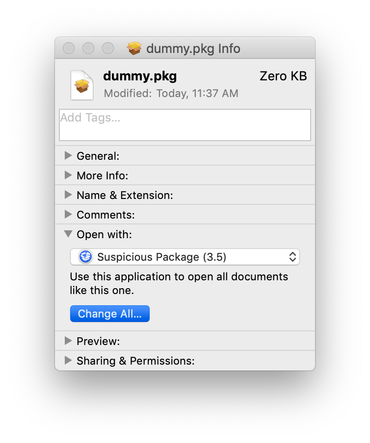
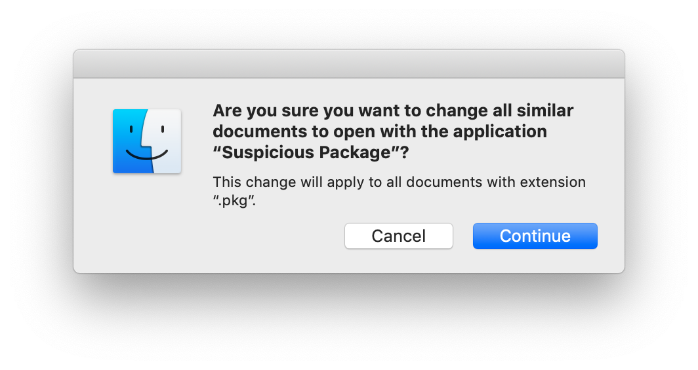

# Unpack Zoom

Zoom is a terrible app.

I wanted to state that right from the beginning, so we'd all be clear.

Even before [the recent security debacle](https://medium.com/@jonathan.leitschuh/zoom-zero-day-4-million-webcams-maybe-an-rce-just-get-them-to-visit-your-website-ac75c83f4ef5) was made known, I had realized that Zoom was terrible. Unfortunately, as I'm not a security researcher, I hadn't grasped _just how bad_ it is, but even a regular person can understand that it is _not good_.

Any app that installs a hidden app in a hidden folder in your home directory is not a good app.

And remember that Zoom initially defended themselves, even after the security problems were made known, saying that they were saving you the hassle of _clicking on a prompt in Safari_.

## Suspicious Package

Any Mac user concerned about security should be using [Suspicious Package](https://www.mothersruin.com/software/SuspiciousPackage/get.html). There's a good [usage page](https://www.mothersruin.com/software/SuspiciousPackage/use.html) but really, just do this:

1. Download and install _Suspicious Package_.
2. Find a .pkg file and select it in Finder
3. Press ⌘+I (that's an uppercase `i`) to show the "Get Info"
4. Set the "Open with" to "Suspicious Package"
5. Click "Change All..."
6. Confirm by clicking "Continue" when prompted

Those two steps should look like this:

Choose "Change All..."

Choose 'Continue'

After that, any time you double-click on a `.pkg` file (or even look at one using QuickLook), it will open in **Suspicious Package.app** instead of the default **Installer.app** (you'll see why this is especially important for Zoom a little later).

**Suspicious Package** is completely free, and will show you the files that will be installed (except for Zoom, more on that later) as well as any scripts that will be run before or after installation. Just start looking at normal packages and you'll get a sense for when something doesn't seem 'right' but most of the time, it'll be fine, and if you want to open the .pkg in the official **Installer.app** you can do that right from **Suspicious Package**.

### **Suspicious Package and Zoom**

I have used **Suspicious Package** for years and years, and I can tell you this, I have _never_ seen anything like Zoom.

When you open the package, **Suspicious Package** will flash its "Review Warning" button. That's not _too_ unusual, and most of the time it's innocuous and harmless.