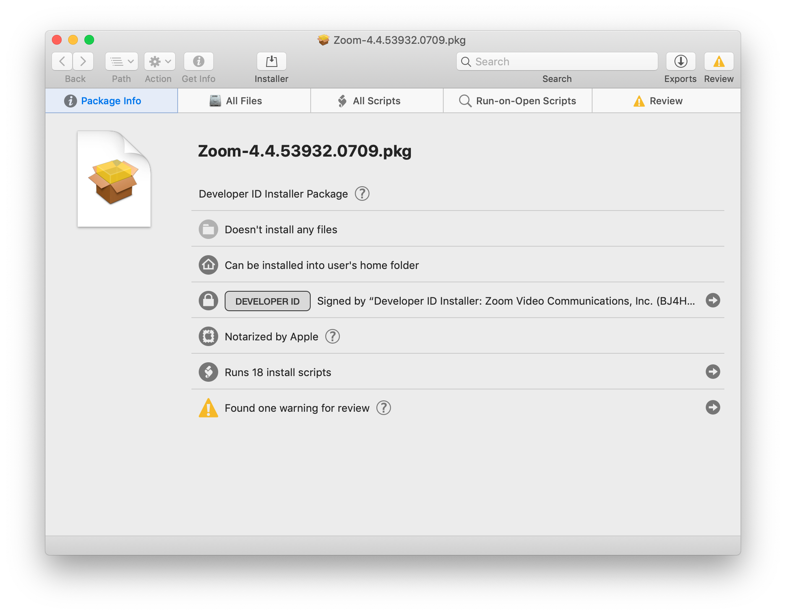
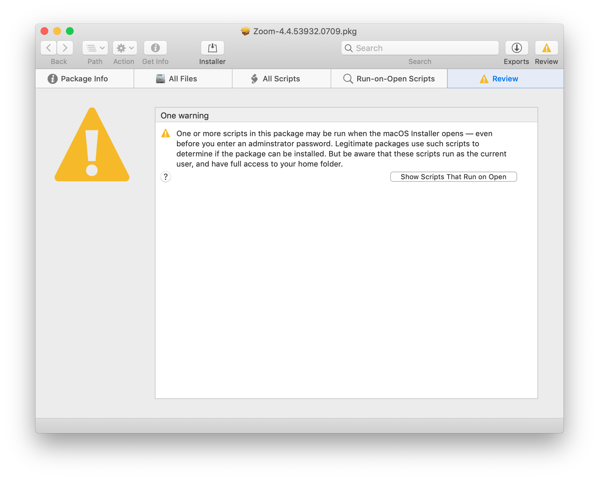
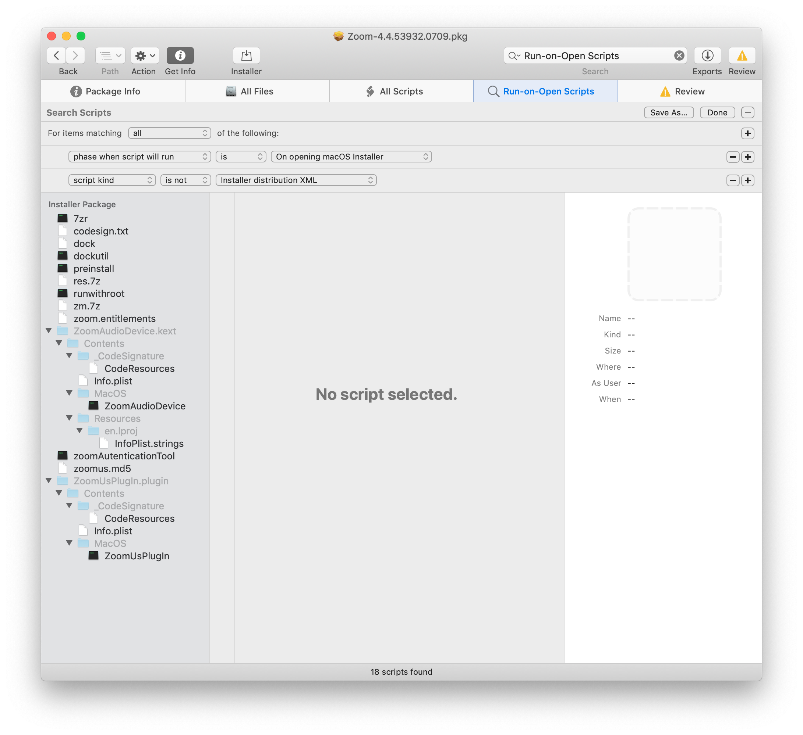
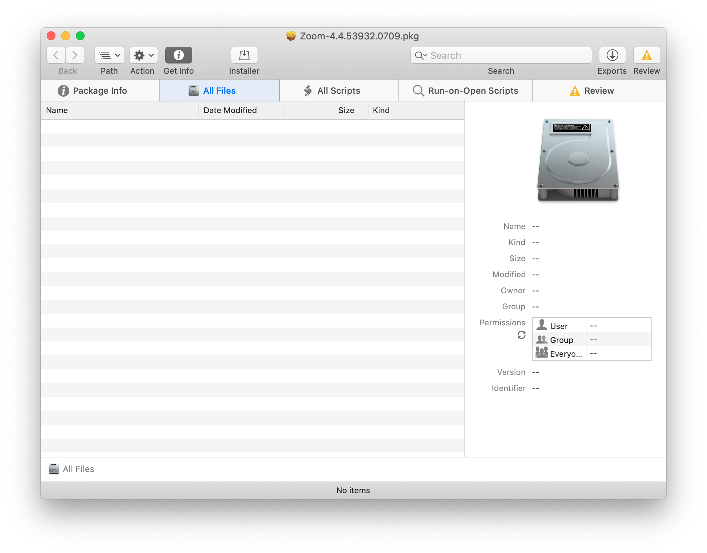

# Unpack Zoom

Zoom is a terrible app.

I wanted to state that right from the beginning, so we'd all be clear.

Even before [the recent security debacle](https://medium.com/@jonathan.leitschuh/zoom-zero-day-4-million-webcams-maybe-an-rce-just-get-them-to-visit-your-website-ac75c83f4ef5) was made known, I had realized that Zoom was terrible. Unfortunately, as I'm not a security researcher, I hadn't grasped _just how bad_ it is, but even a regular person can understand that it is _not good_.

Any app that installs a hidden app in a hidden folder in your home directory is not a good app.

And remember that Zoom initially defended themselves, even after the security problems were made known, saying that they were saving you the hassle of _clicking on a prompt in Safari_.

## Suspicious Package

Any Mac user concerned about security should be using [Suspicious Package](https://www.mothersruin.com/software/SuspiciousPackage/get.html). There's a good [usage page](https://www.mothersruin.com/software/SuspiciousPackage/use.html) but really, just do this:

1. Download and install _Suspicious Package_.
2. Find a .pkg file and select it in Finder
3. Press ⌘+I (that's an uppercase `i`) to show the "Get Info"
4. Set the "Open with" to "Suspicious Package"
5. Click "Change All..."
6. Confirm by clicking "Continue" when prompted

Those two steps should look like this:

Choose "Change All..."

Choose 'Continue'

After that, any time you double-click on a `.pkg` file (or even look at one using QuickLook), it will open in **Suspicious Package.app** instead of the default **Installer.app** (you'll see why this is especially important for Zoom a little later).

**Suspicious Package** is completely free, and will show you the files that will be installed (except for Zoom, more on that later) as well as any scripts that will be run before or after installation. Just start looking at normal packages and you'll get a sense for when something doesn't seem 'right' but most of the time, it'll be fine, and if you want to open the .pkg in the official **Installer.app** you can do that right from **Suspicious Package**.

### **Suspicious Package and Zoom**

I have used **Suspicious Package** for years and years, and I can tell you this, I have _never_ seen anything like Zoom.

Here's the first screen you get when you open the Zoom .pkg file that was released _just after_ the zero-day:

That "Attention Triangle" at the top-right will "pulse" to get your attention when you open the .pkg. That's not _too_ unusual, and most of the time it's innocuous and harmless. But Zoom's is unique. In all the `.pkg` files I've looked at, I've never seen this:

Huh. "Well, that's weird," I thought to myself. So I clicked on the button to show the scripts that run before installation:

You may not be familiar with this enough to realize, but trust me when I say _that is a helluva lot of scripts and files._

In fact, that almost looks like an entire installation's worth of files.

Turns out, that's exactly what it is. I had tried to figure out what it was doing, but gave up. Jeff Nadeau did not. He tweeted:

<blockquote class="twitter-tweet" data-lang="en">
Oh hey, Zoom is that product that *installs the entire app* inside its package preflight script if it detects that you’re running as administrator. Naughty indeed.
&mdash; jnadeau (@jnadeau) <a href="https://twitter.com/jnadeau/status/1148463913647783936?ref_src=twsrc%5Etfw">July 9, 2019</a></blockquote>

Yeah. I took a closer look, and I'm pretty sure he's right.

So, again _to be clear,_ when you open the Zoom .pkg file in the regular Installer.app, it will check to see if you are an administrator (most likely you are), and if so, it will just go ahead and install _before you have told it to install._

That's bad and wrong and stupid and bad, and everyone involved in the decision-making process at Zoom which led to that decision should be publicly shamed for their arrogance. They're bad and they should feel bad because they are bad.

Another clue that this "package" file isn't really a package file is when you look at the files that are installed by it, as parsed by **Suspicious Package:**

"What's that?" you might reasonably ask, "The installer doesn't install any files?"

Of course it _does_ but the way that it does it is completely invisible to **Suspicious Package** which is specifically designed to understand .pkg files.

"Maybe the installation process is so complicated that they couldn't use a regular installer?" I thought to myself in a fit of generous-thinking.

Spoiler alert: _it is not_. In fact, it's pretty much exactly what .pkg files were made for. The people at Zoom just apparently decided to do their own thing.

Zoom, as a company, no longer qualifies for "the benefit of the doubt" so I decided to take a closer look.

It isn't pretty.

## What Zoom.pkg does and how

The Zoom.pkg is basically a wrapper around a few shell scripts. There are [legitimate reasons for doing this](https://derflounder.wordpress.com/2014/06/01/understanding-payload-free-packages/) but Zoom's reasoning is… well, it seems like it's either evil or stupid.

If they don't know any better, then it's stupid.

If they do know better, well, it's the other thing.

I've been writing shell scripts since some time during 1991. It's now 2019. I've gotten pretty good at them. I'm sure there are still things that I could learn and idiosyncratic tendencies that I've picked up that others might do differently and even better.

But when I say that these are badly written shell scripts, I hope you'll understand that I'm saying this with a little bit of experience both reading and writing them.

Here's just one example, from the `preinstall` script:

    find "$APP_PATH" -name ".DS_Store" | sed 's/ /\\ /' | xargs rm

Let me explain what this is doing. Step 1:

    find "$APP_PATH" -name ".DS_Store"

'Look in the folder "$APP_PATH" for any files named ".DS_Store". What is implied is "and show me the full path to each of them". They could make that explicit by writing it as

    find "$APP_PATH" -name ".DS_Store" -print 

but the effect is the same either way. One way is just more clear.

Step two: 

	| sed 's/ /\\ /' 

Then send (or "pipe") the output through `sed` and put a slash `/` in front of any spaces. (More on this in a moment.) 

Step three:

	| xargs rm

The send all of those files to the `rm` command (which will delete them).

So, there are several problems here. 

First of all, the `sed` line is completely unnecessary. `find` already has way of dealing with paths with spaces in it. Instead of using `-print` (as shown above) you would just use `-print0` and then you would use `xargs -0 rm` instead of just `xargs rm`.

But then it turns out that `xargs` is completely unnecessary too, as is `-print0` for `find` because **find already has the ability to delete files that it finds.** 

It's called… _wait for it_ … `-delete`. So that entire line, with two pipes and a completely unnecessary use of `sed`, could be replaced with this one command:

    find "$APP_PATH" -name ".DS_Store" -delete

Not only is it shorter, it's more clear what it is doing. Even if someone did not understand what `find` does, they could probably guess by looking at it.

The scripts are full of these strange choices, which suggest to me that they were written by someone who didn't really know what they were doing, they just knew enough to be dangerous (literally, as the zero-day showed).

## But wait, there's (much) more...

Inside the Zoom `.pkg` file is `7zr` which is a tool from the [7-Zip](https://www.7-zip.org) folks. 7-Zip isn't installed by default on macOS, which is presumably why they include it. Except… it isn't needed. At all. You could accomplish the exact same thing using `tar` on any Mac, going back as far as I can remember.

Why did they use `7-Zip` instead of `tar`? I honestly don't know. I assume they thought it would compress better than `tar`.

They also include `dock` and `dockutil` which are appear to try to force zoom.us.app into your Dock, but their script doesn't seem to work on Mojave. Of course it's a bad and rude practice to put an app in someone's Dock without asking, but, hey, this is Zoom, and Zoom knows best, right?!

(I'm sure they'd defend that choice by saying "But it's easier!" Which was their reasoning for installing an insecure webserver on your Mac which would reinstall the app even if you removed it. Which is what led to this debacle in the first place. Again, this seems like stupidity or arrogance.)

There are a bunch of other files. Here's a full list

* ZoomAudioDevice.kext
* 7zr (compiled and executable)
* codesign.txt (text)
* dock (plist)
* dockutil (python script)
* preinstall (shell script)
* res.7z (compressed 'zMacRes.bundle' which isn't in the main app for some reason)
* runwithroot (shell script)
* zm.7z (actual zoom.us.app)
* zoom.entitlements (plist of entitlements zoom wants)
* zoomAutenticationTool (compiled and executable)
* zoomus.md5 (md5 checksum)

That's just some of them. I think those are just the `preinstall` scripts.

## How do I get just what I want?

I decided that I no longer want to use the Zoom installer, because I just don't trust what they are doing enough to let it go on like this.

However, I do "need" to use Zoom on occasion, and I do want to keep up-to-date, so I wanted to figure out how to automate that as best as I could.

Enter `unpack-zoom.sh`.

I can run

	unpack-zoom.sh ~/Downloads/Zoom.pkg

And it will do the following:

1. Unarchive the .pkg using `xar` (built-in Mac command).
2. Uncompress the 'Scripts' file that is created from the `.pkg`
3. Run `7zr` on the `zm.7z` file to unpack the latest version of "zoom.us.app"
4. Run `7zr` on 'res.7z' to install the "zMacRes.bundle" into the app
5. If the app is installed at either /Applications/ or "$HOME/Applications/" it will offer to move the new version there. (The old version is moved to the trash.)
6. If the 'ZoomUsPlugIn.plugin' is in either the '/Library/Internet Plug-Ins' folder or the "$HOME/Library/Internet Plug-Ins" folder it will offer to move the new version there.  (The old version is moved to the trash.)
7. If (n)either are installed, bot the app and the plugin will be left in the ~/Downloads/ folder next to the .pkg file (or whatever file the .pkg file was in originally) so that I can choose what to do with them.

As for the rest of the files and actions, I'm going to ignore them until I see what (if anything) breaks.

The script tries to be very explicit about what it is doing, and it is thoroughly commented, so anyone should be able to understand what it does, and change it if they so choose. I'm only using standard macOS tools and the included `7zr` tool, so you should not need to install anything special to make this work, and it will not make any unannounced changes to your system.

## A little more automation, if you want it

If you want to know if your installation of **zoom.us.app** is outdated, check out [di-zoom.sh](https://github.com/tjluoma/di/blob/master/di-zoom.sh) from my [di (download and install)](https://github.com/tjluoma/di/) repository. I modified `di-zoom.sh` so it does not automatically install the .pkg any more, but it will check to see if you are up-to-date, and if not, it will download the latest version of Zoom for you. It will even put the version number in the filename so instead of `zoom.pkg` you'll get `Zoom-4.4.53932.0709.pkg` which is helpful if you want to know what version you have downloaded/installed.

I plan to update `di-zoom.sh` to use `unpack-zoom.sh` if it is found, but it will still require interaction to complete the update/install (at least for the time being).

## Dear Zoom: Do Better

To the folks at Zoom: I realize that re-writing your Mac installer to be a better Mac citizen probably seems boring, but it would be a sign of good faith that you are learning from your grievous mistakes and care enough to want to do better.

I wrote this script up in an evening. Surely one of your developers could overhaul the entire thing in a day or so, and maybe even come up with something better. Feel free to use my script as a starting point if you'd like. It's written in `zsh` which is very much like `bash` and will be the default shell in Catalina, so it might be a good time to make the whole thing better.

And please, if nothing else, use the installer properly, instead of the way that you're doing it now. You've been playing fast-and-loose for awhile now, and it's been easier, but it's finally caught up with you, and that's a good reason to do things The Right Way. Like using a proper `.pkg` that isn't doing sneaky things that no one would expect.

## Feel free to use, mostly. (aka "License Terms")

This script is free to use/modify/redistribute as you see fit, with the following limitations: 

- Making mention of my name in the acknowledgments would be nice, but not required. Same goes for a link back to here.

- **There is absolutely no warrantee or guarantee or anything else like that. If anything breaks, it is absolutely 100% not my fault. If laws in your area do not allow me to disavow any/all responsibility, then you are not allowed to use this script.**

- More limitations may be added if deemed necessary, although that seems entirely unlikely.

## How to: 1) install or 2) use without installing

If you're reading this, you probably know how to install this, but if you don't, that's OK too, I'll explain.

1. Download [unpack-zoom.sh](https://raw.githubusercontent.com/tjluoma/unpack-zoom/master/unpack-zoom.sh) to your ~/Downloads/ folder
2. In Terminal.app, type: `chmod 755 ~/Downloads/unpack-zoom.sh`
3. Then put it in /usr/local/bin/ or somewhere else in your `$PATH`.

If you don't want to 'install' it, you don't have to, just skip step 3 and you can leave it in your ~/Downloads/ folder. After you have downloaded `Zoom.pkg` you can use this command to run the script:

	~/Downloads/unpack-zoom.sh ~/Downloads/zoom.pkg

Replace `zoom.pkg` with the actual name of the file that you have downloaded. 

Any questions/problems, [let me know here](https://github.com/tjluoma/unpack-zoom/issues).

